  **Руководство администратора**

Введение 
=========

Назначение системы
------------------

Информационная система «DiState: Оператор ЭДО» (Далее – Система) применяется для
обмена электронными юридически значимыми документами между Клиентами Оператора.

Возможности системы
-------------------

Система представляет собой web-приложение с доступом из сети Интернет. Система
устанавливается на сервере Оператора. Работа пользователей с Системой
выполняется с помощью интернет-браузера. Пользователями Системы являются
сотрудники Оператора, уполномоченные исполнители компаний, использующих Систему
для обмена электронными документами и физические лица, зарегистрированные в
Системе как Клиенты.

Основными возможностями Системы являются:

1.  Создание электронных документов и формирование ЭП к ним.

2.  Электронный обмен документами между контрагентами.

Уровень подготовки пользователя
-------------------------------

Настоящее руководство предназначено для пользователей с ролью «Администратор
компании». Пользователь Администратор должен иметь навыки работы с операционными
системами семейства Microsoft Windows, интернет-браузером, знать принципы работы
с программой шифрования данных и сертификатами ключа проверки квалифицированной
ЭП.

Необходимая эксплуатационная документация
-----------------------------------------

-   Руководство пользователя.

-   Руководство администратора.

-   Руководство системного программиста.

Основные понятия
================

В настоящем руководстве использованы следующие термины и обозначения:

**Администратор -** пользователь Системы с ролью «Администратор компании».

**Администратор Клиента** - сотрудник Клиента, зарегистрированный в Личном
кабинете Клиента, имеющий ролевые права «Администратор компании».

**Администратор Оператора** - сотрудник Оператора, зарегистрированный в Личном
кабинете Оператора, уполномоченный выполнять обязанности Администратора и
наделенный соответствующими правами: имеет роль «Администратор компании».

**Оператор** - организация, предоставляющая услуги электронного документооборота
с помощью Системы Клиентам.

**Клиент** – юридическое лицо, индивидуальный предприниматель или физическое
лицо, использующие Систему для электронного документооборота по правилам,
установленным Оператором.

**Система** – программный продукт «DiState: Оператор ЭДО», устанавливаемый на
серверах Оператора.

**Владелец сертификата** – уполномоченное лицо Клиента или Оператора, на имя
которого выпускается сертификат ключа ЭП.

**Электронная подпись** (ЭП) – реквизит [электронного
документа](https://ru.wikipedia.org/wiki/%D0%AD%D0%BB%D0%B5%D0%BA%D1%82%D1%80%D0%BE%D0%BD%D0%BD%D1%8B%D0%B9_%D0%B4%D0%BE%D0%BA%D1%83%D0%BC%D0%B5%D0%BD%D1%82),
полученный в результате криптографического
преобразования [информации](https://ru.wikipedia.org/wiki/%D0%98%D0%BD%D1%84%D0%BE%D1%80%D0%BC%D0%B0%D1%86%D0%B8%D1%8F) с
использованием [закрытого
ключа](https://ru.wikipedia.org/wiki/%D0%97%D0%B0%D0%BA%D1%80%D1%8B%D1%82%D1%8B%D0%B9_%D0%BA%D0%BB%D1%8E%D1%87) подписи
и позволяющий проверить отсутствие искажения информации в электронном документе
с момента формирования подписи (целостность), принадлежность подписи
владельцу [сертификата ключа
подписи](https://ru.wikipedia.org/wiki/%D0%A1%D0%B5%D1%80%D1%82%D0%B8%D1%84%D0%B8%D0%BA%D0%B0%D1%82_%D0%BE%D1%82%D0%BA%D1%80%D1%8B%D1%82%D0%BE%D0%B3%D0%BE_%D0%BA%D0%BB%D1%8E%D1%87%D0%B0) (авторство),
а в случае успешной проверки подтвердить факт подписания электронного документа
(неотказуемость). В Системе используется только квалифицированная электронная
подпись (согласно 63-ФЗ  «Об электронной подписи).

**Личный кабинет** - web-интерфейс Системы для работы пользователей.
Функциональность Личного кабинета Оператора повторяет функциональность Личного
кабинета Клиента и содержит дополнительные разделы «Система» и «Тарифы»,
доступные только уполномоченным сотрудникам Оператора (подробнее см. Руководство
пользователя).

**Роль** – совокупность прав в Системе, связанная с определенными видами
документооборота, которая назначается пользователю Системы.

Принципы администрирования
==========================

Структура Системы
-----------------

Общая архитектура Системы приведена на Рис.1:

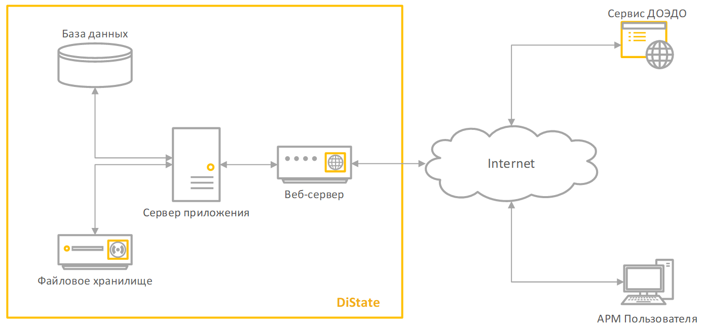
Рис.1. Общая архитектура Системы

Система включает в себя автоматизированное рабочее место пользователя (АРМ),
веб-сервер, сервер приложения, сервер баз данных, файловое хранилище. Последние
четыре компоненты могут располагаться на одном физическом или виртуальном
сервере.

Состав Системы и назначение подсистем
-------------------------------------

-   Подсистема регистрации. Подсистема обеспечивает регистрацию компаний и
    пользователей Системы. Первичные регистрационные данные о пользователе и
    компании берутся из квалифицированного сертификата пользователя.

-   Подсистема личного кабинета Клиента. Подсистема реализует функционал
    управления данными Клиента и предоставляет пользовательские интерфейсы для
    выполнения операций электронного документооборота.

-   Подсистема личного кабинета Оператора. Подсистема содержит весь функционал
    Личного кабинета Клиента, а также функционал управления Клиентами
    (активация/деактивация, просмотр списка Клиентов).

-   Подсистема обмена формализованными документами. Подсистема обеспечивает
    формирование, подписание и отправку формализованных документов
    (универсальный передаточный документ, универсальный корректировочный
    документ, акт, накладная).

-   Подсистема обмена неформализованными документами. Подсистема обеспечивает
    возможность обмена неформализованными типами документов.

-   Подсистема информационного обмена с сервисом ДОЭДО. Сервис ДОЭДО
    обеспечивает выполнение следующих функций Системы:

-   Формирование и проверка электронной подписи.

-   Формирование квитанций для документооборота по универсальным передаточным
    документам.

-   Формирование уникальных идентификаторов участника электронного
    документооборота.

-   Ведение журнала событий в Системе (аудит).

-   Прием и отправка информационных сообщений в ФНС.

Модель пользовательских полномочий
----------------------------------

Полномочия пользователя Системы определяются набором ролевых прав пользователя.
Ролевые права пользователя настраиваются и предоставляются пользователю
Администратором.

По умолчанию в Системе существует две основных роли:

-   Администратор компании.

-   Сотрудник компании

Роль «Администратор компании» предоставляет права доступа ко всем разделам
Личного кабинета: к подразделениям, к списку сотрудников, настройке реквизитов
компании, позволяет активировать/деактивировать пользователей Личного кабинета,
настраивать роли и назначать их пользователям Личного кабинета, добавлять
подразделения компании и изменять их реквизиты.

Роль «Сотрудник компании» по умолчанию присваивается всем сотрудникам Личного
клиента и позволяет работать с документами в Системе.

При регистрации Клиента роль «Администратор компании» назначается пользователю,
который зарегистрировал компанию в Системе. После активации Личного кабинета
Администратор может предоставить права «Администратора компании» (роль) любому
другому зарегистрированному в Личном кабинете пользователю.

Администратор Оператора также имеет роль «Администратор компании» и кроме
перечисленных выше функций имеет права по активации/деактивации Клиентов
Оператора. Администратор Оператора не имеет доступа к Личным кабинетам Клиентов.

Обязанности и задачи администратора
-----------------------------------

Основными задачами Администратора являются:

-   Управление учетными записями пользователей (активация/деактивация
    сотрудников).

-   Управление правами пользователей.

-   Управление учетными записями Клиентов Оператора.

-   Управление настройками Личного кабинета.

Условия применения
==================

Требования к обеспечению рабочего места Администратора
------------------------------------------------------

### Требования к программному обеспечению

На рабочем месте Администратора должно быть установлено следующее программное
обеспечение:

-   Операционная система MS Windows (не ниже версии 7), либо операционная
    система MacOS 10 и выше;

-   Интернет-браузер Google Chrome версии 55 и выше, либо Internet Explorer
    версии 11 и выше, либо Mozilla Firefox версии 55 и выше, либо Apple Safari
    10 и выше.

-   СКЗИ КриптоПро CSP, версия 4.0 R3 и выше;

-   КриптоПро ЭЦП Browser plug-in 2.0.13 и выше.

**Примечание.** Инструкция по установке и настройке криптографических продуктов,
необходимых для работы пользователя с Системой, приведена в Руководстве
системного программиста.

**Примечание.** Перед началом работы на компьютере пользователя должно быть
установлен квалифицированный сертификат ЭП. При наличии сертификата на е-токене,
перед началом работы с Системой е-токен необходимо подключить к компьютеру.

### Требования к техническому обеспечению

Компьютер пользователя должен соответствовать следующим минимальным требованиям:

IBM-совместимый компьютер:

-   процессор Intel x86, либо Intel x86-64;

-   тактовая частота не менее 1 ГГц;

-   оперативная память не менее 1 Гб;

-   жесткий диск с объемом свободного пространства не менее 100 Мб.

Подготовка к работе 
====================

Перед началом работы с Системой необходимо установить соответствующее
программное обеспечение и дополнительное ПО, необходимое для работы с Системой,
указанное в п. [4](#требования-к-обеспечению-рабочего-места-администратора), а
также выполнить активацию Личного кабинета. Процедура активации Личного кабинета
описана в п.4 Руководства пользователя.

Вход в Систему 
---------------

Для входа в Систему пользователь должен ввести URL-адрес размещения Системы в
сети Интернет. После этого в браузере отобразиться форма авторизации в Системе:

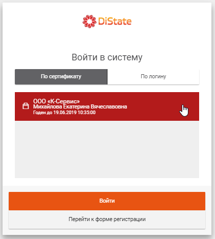

  
Рис.2. Форма авторизации

На форме авторизации отображается список всех установленных на компьютере
сертификатов ЭП, которые могут быть использованы для входа в Систему.

Для входа в Систему по сертификату, пользователю необходимо в форме авторизации
выбрать сертификат (в списке доступны сертификаты, которые уже зарегистрированы
на компьютере пользователя) и нажать на кнопку «Войти» (см. Рис.2).

Пользовательский интерфейс
--------------------------

После успешной авторизации в Системе, в браузере откроется страница Личного
кабинета:

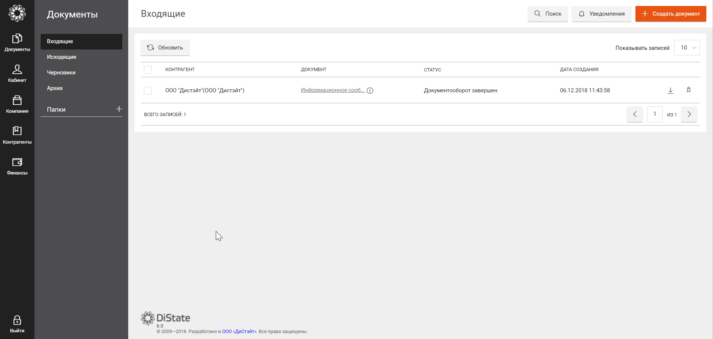

Рис. 3. Личный кабинет

Слева располагается меню разделов:

-   Раздел «Документы» предназначен для документооборота с контрагентами. Все
    входящие, исходящие и архивные документы хранятся в этом разделе.

-   Раздел «Кабинет» содержит настройки пользователя.

-   Раздел «Компания» содержит настройки Клиента/Оператора. Предназначен для
    настройки данных компании, активации/деактивации сотрудников компании,
    настройки ролей и прав доступа к Системе.

-   Раздел «Контрагенты» содержит список юридических лиц, индивидуальных
    предпринимателей и физических лиц, с которыми Клиент планирует вести или уже
    ведет электронный документооборот.

-   Раздел «Финансы» содержит информацию о текущем тарифном плане компании,
    историю по совершенным транзакциям, позволяет сменить тарифный план и
    пополнить баланс компании.

-   Раздел «Система» содержит список Клиентов Оператора и запросов на активацию
    Клиентов. Раздел доступен только в Личном кабинете Оператора.

-   Раздел «Тарифы» содержит список действующих и архивных тарифов Оператора.
    Раздел доступен только в Личном кабинете Оператора.

-   Кнопка «Выйти». При нажатии на кнопку «Выйти» сеанс работы с Системой
    завершается.

**Примечание.** Личный кабинет Оператора отличается от Личного кабинета Клиента
наличием дополнительных разделов «Система» и «Тарифы».

Подробнее интерфейс пользователя описан в Руководстве пользователя.

Завершение работы в Системе
---------------------------

Для завершения работы с Системой пользователю необходимо нажать на кнопку
«Выйти».

Описание операций
=================

Назначение полномочий пользователям
-----------------------------------

Управление правами пользователей выполняется в разделе
«Компания» → «Сотрудники»:

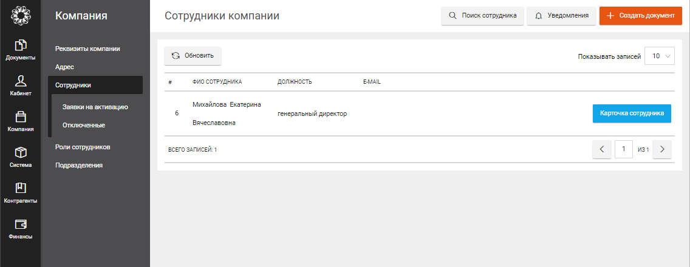

  
Рис. 4. Подраздел «Сотрудники»

Для назначения полномочий пользователю необходимо найти пользователя в списке
сотрудников и открыть карточку сотрудника, нажав кнопу «Карточка сотрудника».

При нажатии на кнопку «Карточка сотрудника», выводится следующая информация по
выбранному пользователю:

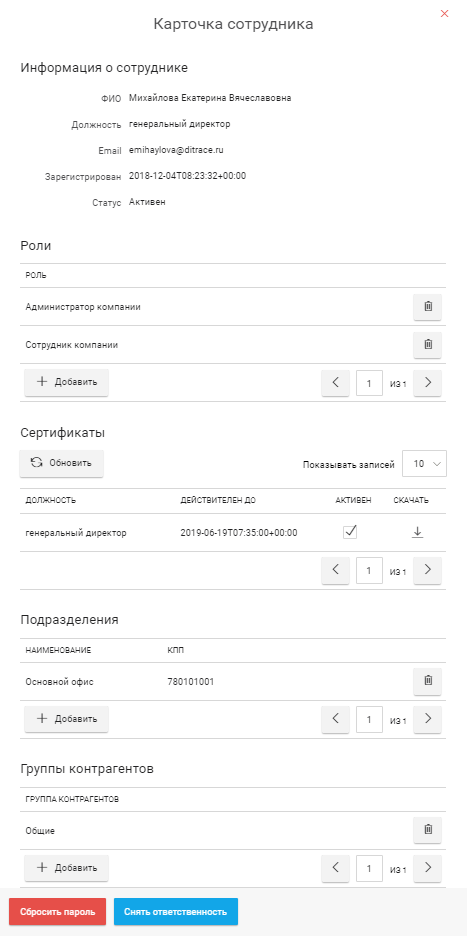

  
Рис. 5. Карточка сотрудника

Ролевые права на выполнение операций пользователю назначаются в разделе «Роли»
карточки сотрудника:

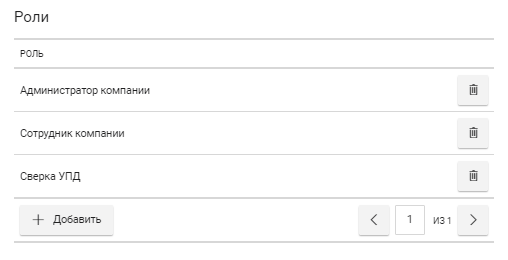

  
Рис. 6. Роли сотрудника

Для добавления роли необходимо нажать кнопку «+ Добавить», для удаления роли
значок корзины

. При нажатии на кнопку «+ Добавить» предлагается выбрать новую роль для
пользователя:

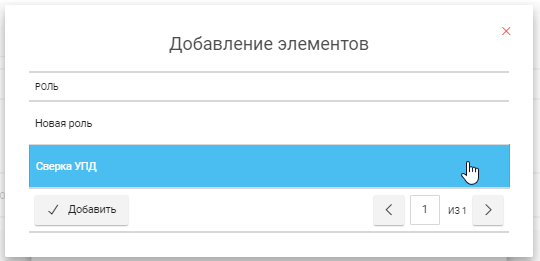

  
Рис. 7. Добавление роли

После добавления роли у пользователя появляются права, предусмотренные данной
ролью.

В разделе «Группа контрагентов» указывается список групп контрагентов с
документами которых будет работать сотрудник: для работы с документами у
пользователя должна быть задана одна или несколько групп контрагентов, в
противном случае он не будет иметь возможность работать с документами
контрагентов (не будет их видеть). Подробнее см. пункт «Группы контрагентов» в
Руководстве пользователя.

При регистрации нового сотрудника Администратору необходимо заполнить
обязательные разделы карточки сотрудника:

-   Роли.

-   Подразделения.

-   Сертификаты.

Если Администратор не указал роль и подразделение сотрудника, пользователь не
сможет выполнять никаких действий в Системе. Если Администратор не добавил и/или
не активировал сертификат сотрудника, пользователь не сможет подписывать и
отправлять документы.

Управление учетными записями пользователей
------------------------------------------

### Регистрация нового пользователя

Регистрация новых пользователей в Системе происходит по запросу пользователя
одним из двух способов.

#### Регистрация пользователя по сертификату

Для первоначальной регистрации пользователя в Системе пользователю необходимо
авторизоваться при помощи ЭП. Для этого необходимо нажать на кнопку «Перейти к
форме регистрации» (Рис.8), выбрать нужный сертификат из списка сертификатов,
установленных на компьютере пользователя и нажать на кнопку «Зарегистрировать»:

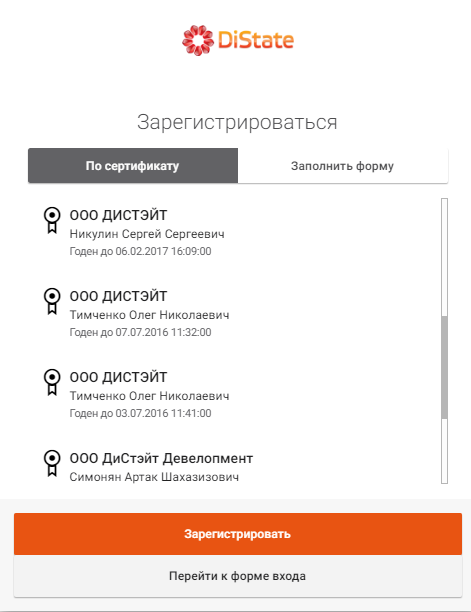

  
Рис. 8. Регистрация по сертификату

После регистрации по сертификату Система отправить уведомление Администратору и
выдаст сообщение о том, что заявка пользователя ожидает активации:

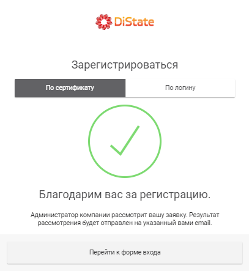

  
Рис. 9. Сообщение об ожидании активации

После ввода данных и нажатии на кнопку «Зарегистрировать» Администратор компании
получит уведомление на электронную почту о том, что пришел запрос на добавление
нового сотрудника. В случае если данные сертификата указывают, что такая
компания уже есть в Системе, будет создан новый пользователь в Личном кабинете.

#### Регистрация пользователя по паре логин-пароль

Если у пользователя отсутствует сертификат, либо у пользователя нет
необходимости в подписании документов в Системе, он может зарегистрироваться
путем ввода информации о себе и компании, к которой он планирует подключиться.

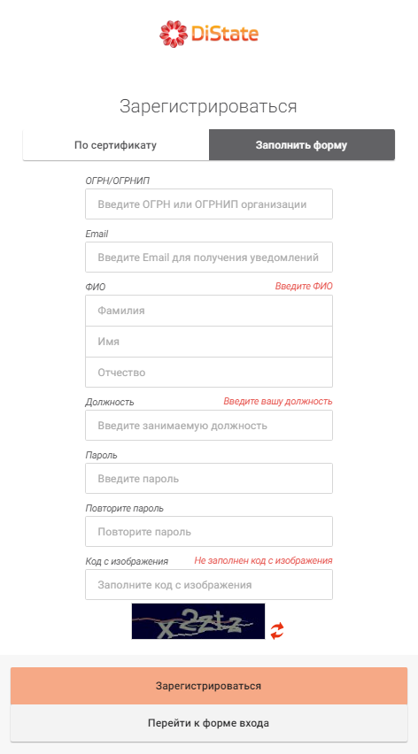

  
Рис. 10. Регистрация по логину и паролю

После ввода данных и нажатии на кнопку «Зарегистрироваться» Администратор
компании получит уведомление на электронную почту о том, что пришел запрос на
добавление нового сотрудника. После активации сотрудник может авторизоваться в
системе по паре логин-пароль:

#### Активация пользователя

Запросы на активацию пользователей попадают в подраздел
«Компания» → «Сотрудники» → «Заявки на активацию» Личного кабинета.

**Примечание**. Заявки попадаются в Личный кабинет той компании, ОГРН который
указан в запрос на активацию. При регистрации по паре логин-пароль ОГРН
указывается в форме ввода. При регистрации по сертификату ОГРН определяется по
сертификату пользователя.

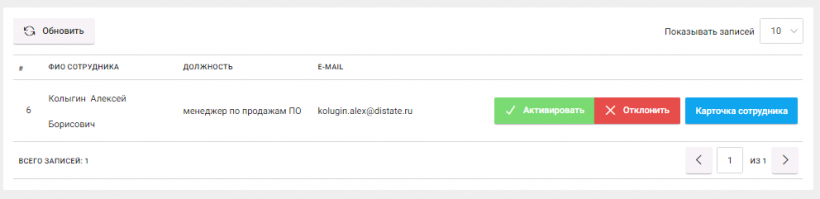

  
Рис. 11. Заявка на активацию сотрудника

Администратор компании может активировать сотрудника, нажав кнопку
«Активировать», либо отклонить заявку, нажав кнопку «Отклонить». При нажатии на
кнопку «Карточка сотрудника» выводится карточка сотрудника, в которой
Администратор указывает права сотрудника. Подробнее см.
п.[6.1](#назначение-полномочий-пользователям).

### Просмотр списка пользователей

Список пользователей Личного кабинета находится в разделе
«Компания» → «Сотрудники» (см. Рис.4).

### Просмотр и редактирование информации о пользователе 

Просмотр и редактирование информации о пользователе выполняется с помощью кнопки
«Карточка сотрудника». При нажатии на кнопку «Карточка сотрудника», выводится
следующая информация по выбранному пользователю (см. Рис.5).

Ролевые права на выполнение операций пользователю назначаются в разделе «Роли»
карточки сотрудника. Подробнее см. п.
[6.2](#назначение-полномочий-пользователям).

В разделе «Сертификаты» указывается список зарегистрированных сертификатов
пользователя. Администратор может активировать и деактивировать сертификат
пользователя с помощью флажка

(колонка «АКТИВЕН»). Авторизация пользователя в Системе возможна только по
активированным сертификатам.

В разделе «Группа контрагентов» указывается список групп контрагентов с
документами которых будет работать сотрудник: для работы с документами у
пользователя должна быть задана одна или несколько групп контрагентов, в
противном случае он не будет иметь возможность работать с документами
контрагентов (не будет их видеть). Подробнее см. пункт «Группы контрагентов» в
Руководстве пользователя.

### Отключение учетной записи пользователя

Отключение учетной записи пользователя блокирует возможность работы пользователя
в Системе. Для отключения учетной записи пользователя Администратор должен
выбрать пользователя в списке сотрудников компании и нажать кнопку
«Деактивировать»:

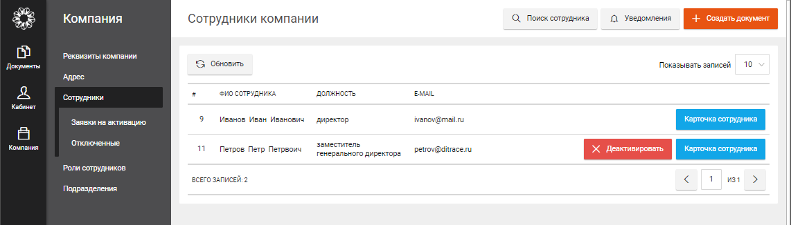

  
Рис.12. Деактивация учетной записи пользователя

Отключенные пользователи попадают в список деактивированных сотрудников в
подраздел «Компания» → «Сотрудники» → «Отключенные» Личного кабинета:

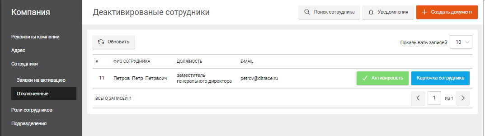

  
Рис.13. Список деактивированных сотрудников

Администратор может повторно активировать учетную запись отключенного
пользователя, нажав кнопку «Активировать» в этом списке.

Управление учетными записями Клиентов
-------------------------------------

**Внимание**. Управление учетными записями Клиентов доступно только
Администратору Оператора в Личном кабинете Оператора.

### Регистрация новых Клиентов 

#### Регистрация Клиента по сертификату

Для первоначальной регистрации Клиента в Системе пользователю (сотруднику
Клиента) необходимо авторизоваться при помощи ЭП. Для этого необходимо нажать на
кнопку «Перейти к форме регистрации» (Рис.14), выбрать нужный сертификат из
списка сертификатов, установленных на компьютере пользователя и нажать на кнопку
«Зарегистрировать»:

  
Рис. 14. Регистрация Клиента по сертификату

После регистрации по сертификату Система выдаст сообщение о том, что заявка
пользователя ожидает активации (см. Рис.9). Это значит, что Администратору
Оператора отправлено сообщение о регистрации новой компании и он должен
подтвердить активацию Клиента. До тех пор, пока регистрация Клиент не будет
произведена, вход в Систему будет невозможен.

#### Активация Клиента

Запросы на активацию Клиентов (юридических и физических лиц) попадают в раздел
«Система» Личного кабинета Оператора:

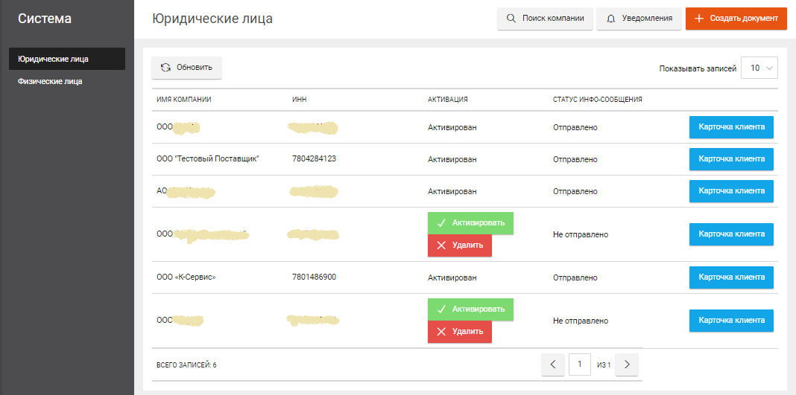

  
Рис. 15. Раздел «Система»

Администратор Оператора может зарегистрировать Клиента в Системе, нажав кнопку
«Активировать» или отказать в регистрации, нажав кнопку «Удалить».

После подтверждения активации в Системе Администратором Оператора создается
учетная запись Клиента (Личный кабинет компании) и учетная запись первого
сотрудника Клиента по сертификату которого выполнялась активация.

**Примечание**. По умолчанию, пользователь, выполнивший первичную регистрацию
Клиента в Системе, получает после прохождения процедуры активации Клиента, права
Администратора личного кабинета Клиента.

### Просмотр списка Клиентов

Просмотр списка Клиентов Оператора выполняется в разделе «Система» Личного
кабинета Оператора (см. Рис.15).

Подраздел «Система» → «Юридические лица» содержит список активированных и
ожидающих активации компаний.

Подраздел «Система» → «Физические лица» содержит список активированных и
ожидающих активации физических лиц.

### Просмотр информации о Клиенте

Просмотр сведений о Клиенте выполняется из раздела «Система» по кнопке «Карточка
клиента»:

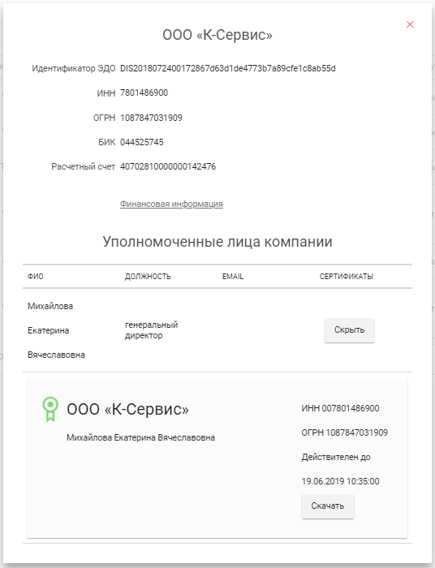

Рис. 16. Карточка Клиента

В карточке Клиента можно посмотреть сертификаты сотрудников Клиента и информацию
по тарифу Клиента (по ссылке Финансовая информация). Подробнее см. Руководство
пользователя.

Управление ролями пользователей
-------------------------------

### Просмотр списков ролей

Просмотр списка ролей выполняется в разделе «Компания» → «Роли сотрудников»
Личного кабинета:

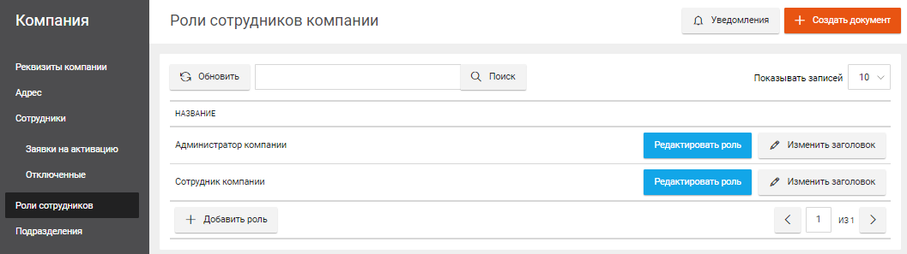

  
Рис. 17. Роли сотрудников компании

По умолчанию в Системе существует две основных роли:

-   Администратор компании.

-   Сотрудник компании

Каждый Клиент может создать и настроить собственный набор ролей.

С помощью кнопки «Изменить заголовок» можно изменить название роли. Набор прав
для каждой роли можно изменить с помощью кнопки «Редактировать роль».

### Просмотр и редактирование роли

Для просмотра информации о роли и редактирования набора ролевых прав роли
необходимо нажать на кнопку «Редактировать роль».

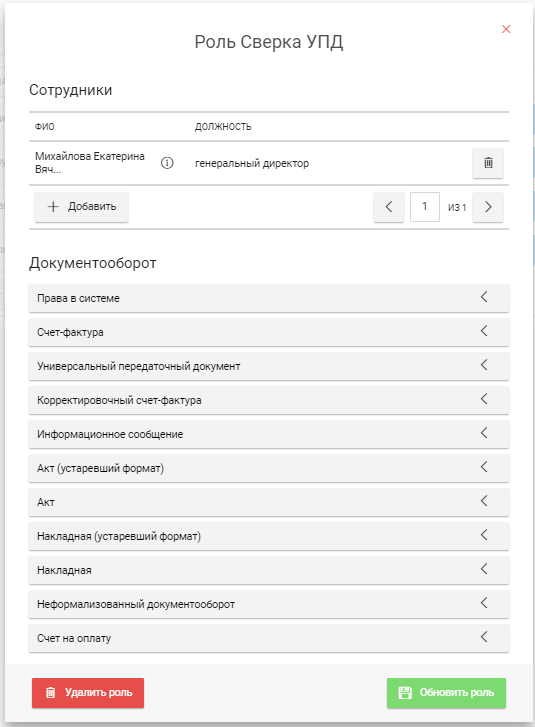

  
Рис. 18. Редактирование роли

В карточке роли отображается список пользователей, которым дана роль и список
полномочий по работе в Системе.

Кнопка «+ Добавить» позволяет добавить к списку пользователей с данной ролью
новых пользователей («назначить» роль на новых сотрудников). Кнопка

позволяет исключить сотрудника из списка - лишить его полномочий (роли).

В разделе «Документооборот» карточки роли находятся раскрывающиеся списки
полномочий, которые доступны для выбранной роли:

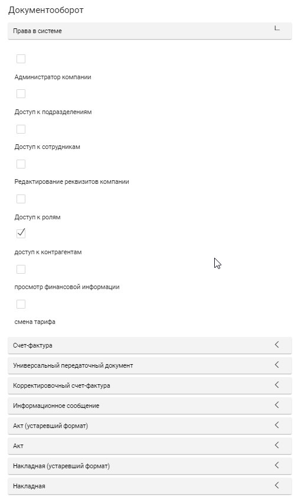

  
Рис. 19. Полномочия роли

Доступные для роли полномочия отмечены флажком

. Помечая полномочие флажком Администратор предоставляет права для роли, снимая
отметку - отнимает права для роли.

### Создание и удаление роли

Для создания новой роли необходимо нажать на кнопку «Добавить роль» в разделе
«Роли сотрудников» (см. Рис.17), ввести название новой роли и перейти к
редактированию набора ролевых прав с помощью кнопки «Редактировать роль». См.
пункт [6.4.2](#просмотр-и-редактирование-роли).

Для удаления роли необходимо нажать на кнопку «Редактировать роль» в разделе
«Роли сотрудников» (см. Рис.17) и в открывшемся окне (Рис.18) нажать на кнопку
«Удалить роль».

### Формирование списка полномочий роли

Формирование списка полномочий выполняется в режиме редактирования роли.
Подробнее см. п. [Просмотр и редактирование
роли](#просмотр-и-редактирование-роли).

#### Права в системе

Права в системе определяют полномочия пользователей по работе с разделами
Личного кабинета и доступом к справочной информации (см. Рис. 19):

-   Администратор компании

-   Доступ к подразделениям

-   Доступ к сотрудникам

-   Редактирование реквизитов компании

-   Доступ к ролям

-   Доступ к контрагентам

-   Просмотр финансовой информации

-   Смена тарифа

#### Права на работу с конкретным видом документов

Полномочия пользователя для работы с документами задаются для каждого вида
документа отдельно (Рис. 20).

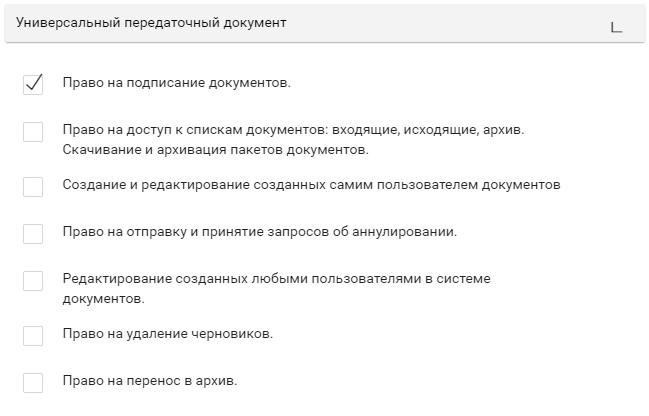

  
Рис. 20. Полномочия по работе с УПД

При работе с неформализованными документами и формализованными документами вида
«Акт», «Накладная», «УПД», «УКД», «Счет на оплату» пользователю можно
предоставить следующие полномочия:

-   Право на подписание документов.

-   Право на доступ к спискам документов: входящие, исходящие, архив. Скачивание
    и архивация пакетов документов.

-   Создание и редактирование созданных самим пользователем документов

-   Право на отправку и принятие запросов об аннулировании.

-   Редактирование созданных любыми пользователями в системе документов.

-   Право на удаление черновиков.

-   Право на перенос в архив.

При работе с формализованными документами устаревших форматов - с документами
вида «Счет-фактура», «Корректировочный счет-фактура», пользователю можно
предоставить следующие полномочия (Рис. 21):

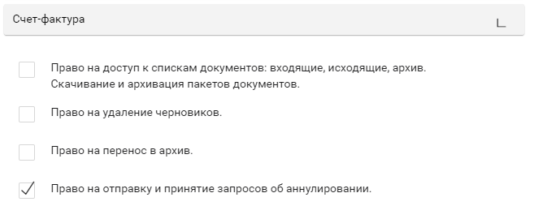

  
Рис. 21. Полномочия по работе с СФ

-   Право на доступ к спискам документов: входящие, исходящие, архив. Скачивание
    и архивация пакетов документов.

-    Право на удаление черновиков.

-    Право на перенос в архив.

-    Право на отправку и принятие запросов об аннулировании.

Настройки компании
------------------

Настройки компании располагаются в разделе «Компания» Личного кабинета (Рис.22).

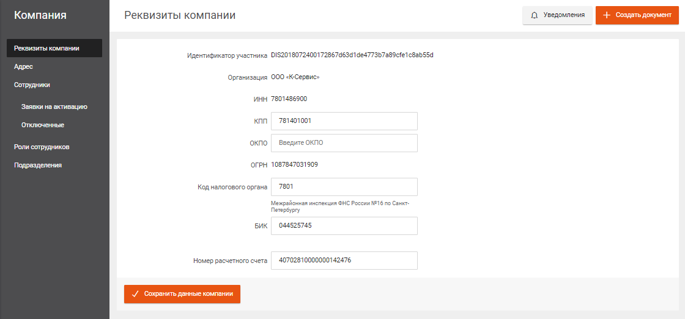

  
Рис. 22. Раздел «Компания»

В подразделе «Реквизиты компании» редактируются реквизиты Клиента, в подразделе
«Адрес» - юридический адрес компании, в подразделе «Подразделения» - структурные
подразделения компании. Подробнее - см. Руководство пользователя.
